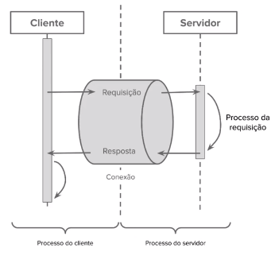

<h1 id="logo" align="center">
  <a name="logo" href="#"></a>
  <br>
  Learning GraphQL Gama
</h1>
<h4 align="center">Aprendendo phQL com aulas do bootcamp da Gama Academy!</h4>
<p align="center"><a align="center" target="_blank" href="https://gama.academy/"></a></p>
<div align="center">
  <h4>
    <a href="https://travis-ci.org/CCOSTAN/Home-AssistantConfig"></a>
    <a href="https://github.com/CCOSTAN/Home-AssistantConfig/stargazers"></a>    
    
  </h4>
</div>
<div align="center"><a name="menu"></a>
  <h4>
    <a href="#clienteservidor">Modelo Cliente e Servidor</a>
    <span> | </span>
    <a href="#request">
      Padrão de Requisição e Resposta
    </a>      
    <span> | </span>
    <a href="#interfaces">
      Implementação do server
    </a>  
     <span> | </span>
    <a href="#monorepo">
      MonoRepository
    </a>    
    <span> | </span>
    <a href="https://amzn.to/2HXSx2M">
      Target do Typescript
    </a>   
    <span> | </span>
    <a href="https://amzn.to/2HXSx2M">
      Herança
    </a>
  </h4>
</div>

### <span id="clienteservidor"> Cliente e Servidor <span>

- Foi um modelo criado pela xerox nos anos 70
- As redes de impressoras, e-mails e a **internet** são baseadas nesse modelo
- É um modelo centralizado, seguro e de fácil manutenção.
- GraphQL é implementado nesse modelo.
- Existe usos de GraphQL em P2P, mas eles são bem mais específicos.


### <span id="request">Padrão de requisição e resposta</span>
- Usando recursos de rede, os clientes fazem requisições para os servidores que as processam e enviam respostas.
- 

### Implementação de um projeto usando o GraphQL

- #### Requisitos
  - node.js
  - npm
- #### Instalação
  - Instalar o ESM com o comando `npm i -D esm`
  - Configurar no package.json `    "start":"node -r esm ."`
  - Para executar o projeto `npm run start`
- #### Criando um server
  ```bash

  import { createServer } from 'http';

    const server = createServer((req,res) => {
        switch (req.url) {
            case '/status':{
                res.writeHead(200);
                res.write('OK');
                res.end();
                return;
            } 
            case '/json': {
                res.writeHead(200, {
                    'Content-Type':'application'
                });
                res.write(JSON.stringify({
                    status:'OK'
                }));
                res.end();
                break;
            }
            default: {
                res.writeHead(404,'Service not found');
                res.end();
            }    
        }
    });
    const ip = process.env.HOSTNAME || "127.0.0.1";
    const port = process.env.PORT ? parseInt(process.env.PORT):8080;

    server.listen(port, ip , () => {
        console.log(`Server is running at http://${ip}:${port}`);
    })
  ```
  - ###### Outras Rotas implementadas no servidor: [main.js](client-server/src/main.js)
    - Usando Renderização, parâmetros e redirecionamentos. 
  <table>
    <th>Rotas</th>
    <th>Respostas</th>
    <tr>
      <td>http://localhost:8080/json</td>
      <td>
        Retorna um json com { status:'ok' }
      </td>
    </tr>
    <tr>
      <td>http://localhost:8080/sign-in</td>
      <td>Retona a página de login</td>
    </tr>
     <tr>
      <td>http://localhost:8080/home</td>
      <td>Retona a página de home</td>
    </tr>
  </table>


  #### MonoRepository com **pnpm**
  - Instalação do pnpm `npm i -g pnpm`
  - Na raiz do diretório root **packages** :
    - executamos o comando `pnpm init`
    - configuramos como `package name: (packages) @dev-demands/root`
  - O projeto foi separado em uma pasta server e outra web
  - No package.json do server adicionamos o `@dev-demands/server` no nome do **projeto server**
  - Para instalar os módulos node no projeto server: `pnpm i --filter @dev-demands/server`
  - Para executar o server `pnpm run start --filter @dev-demands/server`

  #### Criando um app web React
  - Dentro do diretório packages executamos o comando `pnpx create-react-app web` para criar o app
  - caso use o npm ou yarn remover o arquivo package.lock ou yarn.lock e a pasta node_modules
  - executar o `pnpm i --filter @dev-demands/web` para instalar os módulos com o **pnpm** e gerar o pnpm-lock.yaml
  
  #### Configuração do app Web React
  - instalar o pacote de gerência de rotas com: `pnpm i react-router-dom  --filter @dev-demands/web`
  - configurar o react-router-dom para controle de rotas no index.js do app web
  - criar um arquivo Router.js para ter as rotas
  - importar os componentes no <a href="./packages/web/src/Router.js">Router.js</a> que queremos renderizar através das rotas
    <table>
    <th>Rota</th>
    <th>Componente</th>
    <tr><td>/</td><td> <a href="packages/web/src/pages/Home.js">Home.js</a></td></tr>
    <tr><td>/sign-in</td><td><a href="packages/web/src/pages/Signin.js">Signin.js</a></td></tr>
    </table>

  #### Criar um server com express
  - instalar o módulo express `pnpm i express --filter @dev-demands/server`
  - nossos endpoints e middwares usando o **express**:
    ```bash
    import express from 'express';

    const server = express();

    server.get('/status', (_, res) => {
      res.send({
        status: 'OK'
      })
    });

    server.post('/authenticate', express.json(), (req, res) => {
      console.log('Mail:', req.body.mail, 'Password:', req.body.password);
      res.send();
    });

    const ip = process.env.HOSTNAME || "127.0.0.1";
    const port = process.env.PORT ? parseInt(process.env.PORT) : 8080;

    server.listen(port, ip, () => {
      console.log(`Server is running at http://${ip}:${port}`);
    });
    ```

    #### Fazendo requisições assincronas com o app Web
    - Alteramos o Form para adequar-se ao React

    ```bash
      <form onSubmit={handleSubmit}>
        <fieldset>
          <label htmlFor="email">E-mail</label>
          <input
            id="email"
            type="email"
            inputMode="email"
            value={email}
            onChange={handleEmailChange}
            autoComplete="username"
          />
        </fieldset>
        <fieldset>
          <label htmlFor="password">Senha</label>
          <input
            id="password"
            type="password"
            value={password}
            onChange={handlePasswordChange}
            autoComplete="current-password"
          />
        </fieldset>
        <button type="submit">Entrar</button>
      </form>
    ```
    - criamos o método para o que o form acesse a rota de autenticação do server
    ```bash
        const handleSubmit = (event) => {
        event.preventDefault();
        console.log('teste');
        fetch('http://localhost:8000/autheticate',
          {
            method: 'POST',
            headers: {
              'Content-Type': 'application/json'
            },
            body: JSON.stringify({
              email,
              password
            })
          })
          .then((res) => res.json())
          .then(() => {
            console.log('Success!');
          });
      };
    ```
  
  #### Resolvendo o problema de CORS do server
  - instalamos o módulo para resolver o CORS com `pnpm i --filter @dev-demands/server`
  - configuramos no [main.js](packages/server/src/main.js)
    ```bash
      const enableCors = cors({ origin: 'http://localhost:3000' });
    ```
  - Na rota fazemos a configuração dos métodos **OPTIONS**  e  **POST**
    ```bash
        server
          .options('/authenticate',enableCors)
          .post('/authenticate',enableCors, express.json(), (req, res) => {
          console.log('Mail:', req.body.mail, 'Password:', req.body.password);
          res.send();
        });
    ```

  ####  API's RESTful X GraphQL
  ##### Como funciona o RESTful
  - Recebem parâmetros e envia dados usando JSON como formato
  - Tdodas operações são abstraidos detro dos métodos HTTP (GET, POST, PUT, PATH, DELETE e OPTION).
  - As **rotas**, ou **endpoints**, são baseados nas entidades das aplicações
  ##### Problemas
  - As API's nesse formato são limitadas pelos protocolos que as definem.
  - Criam dificuldades para lidar com relações entre as entidades, sendo implementadas manualmente essas relações.
  ##### O que o GraphQL resolve
  - Realizar Cascata de requisições(**Request Waterfall**)
  - Responder com dados mais que suficientes nas API's(**Over-Fetching**) em vez do RESTful(**Under-Fetching**)

  #### ApoloServer
  